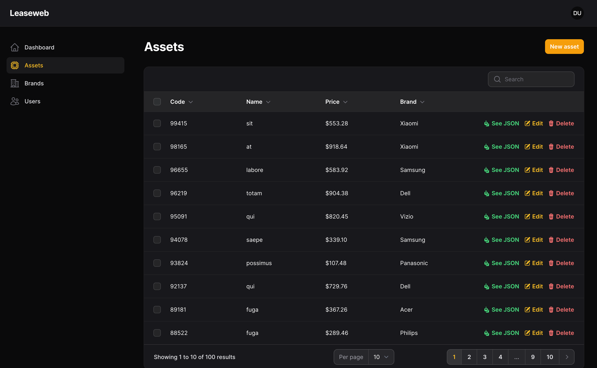
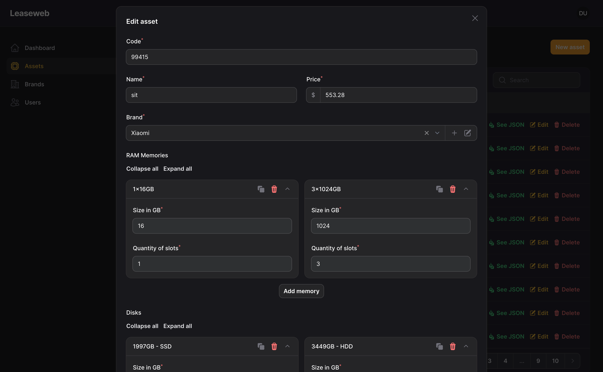
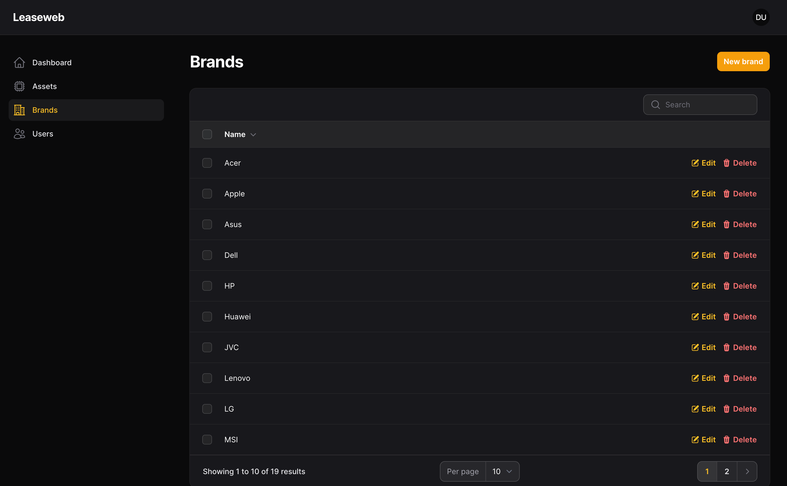
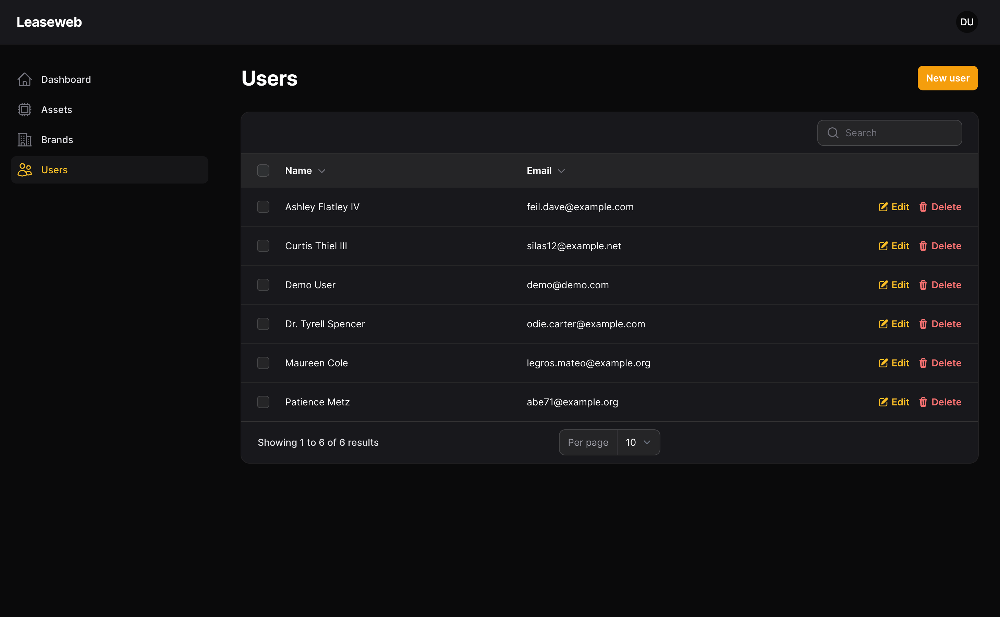
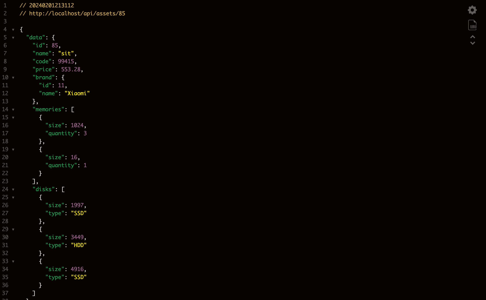
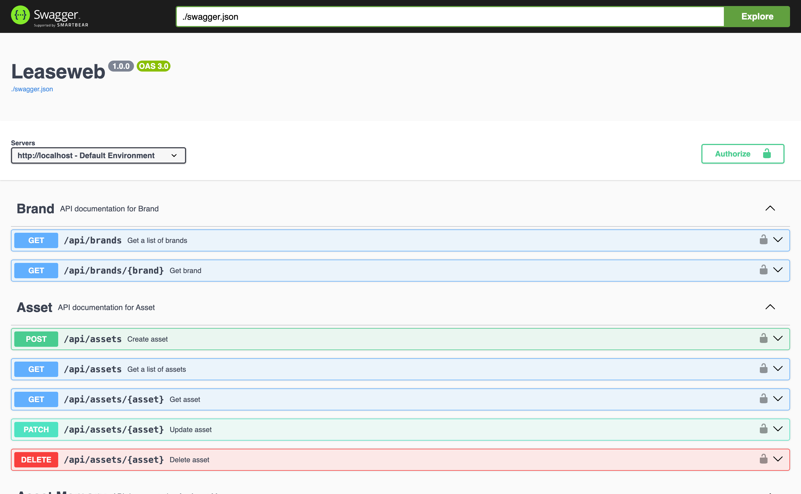

# LeaseWeb

This project has created using Laravel, Laravel Sail, Laravel Octane, Laravel Pint, Laravel Filament and PEST.

I needed 3 hours to develop this project and I will leave some considerations about it:

I created Form Requests, HTTP Resources, Models, Seeders, Factories and Migrations. I created an entity called "Brand", which is linked to Assets. Furthermore, I also added, in addition to the "Memory" information, the "Disks" information to an Asset.

Therefore, the Asset is an entity that is related to the Brand and two tables to store memory and disk. In addition, there is the Users entity.

By running all the commands below, the base is created and fed with fake data to facilitate testing.

There are tests developed with PEST to validate all routes and entities used (except Users).

I used FilamentPHP to create the entire administration panel. I used the most recent version of it. I used Laravel Orion to create the CRUD endpoints for the entities.

I used PHP Enums to create the DiskType. When adding a new option to this Enum, the entire system already reads the new options in the forms and APIs.

Laravel Sail is responsible for the local development environment. In addition, there is Swagger UI at [http://localhost:8080](http://localhost:8080), with API documentation and allowing you to easily perform tests.

## How to run this project

You dont need to change anything in the code. I have hardcoded the .env file to make more easier to run.

### Install the composer dependencies

```
docker run --rm \
    -u "$(id -u):$(id -g)" \
    -v "$(pwd):/var/www/html" \
    -w /var/www/html \
    laravelsail/php83-composer:latest \
    composer install --ignore-platform-reqs
```

### Run the Laravel Sail Up

```
./vendor/bin/sail up -d
```

### Run the Migrations and Seeders

```
./vendor/bin/sail artisan migrate:fresh --seed
```

## How to run the PEST tests

```
./vendor/bin/sail artisan test
```

## How to run the Laravel Pint

```
./vendor/bin/sail composer run lint
```

## How to access the Filament Admin Panel

Just go to the root page and press enter in the login form (the username and password are already filled):

[http://localhost](http://localhost)

## Some screenshots







